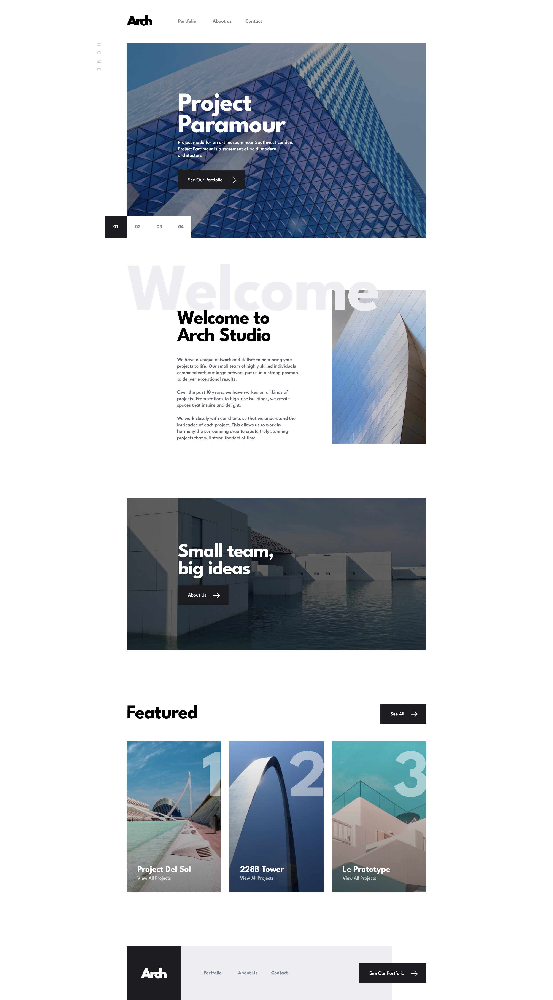
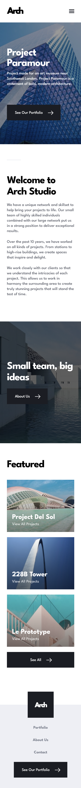

# Frontend Mentor - Arch Studio multi-page website solution

This is a solution to the [Arch Studio multi-page website challenge on Frontend Mentor](https://www.frontendmentor.io/challenges/arch-studio-multipage-website-wNIbOFYR6). Frontend Mentor challenges help you improve your coding skills by building realistic projects.

## Table of contents

- [Overview](#overview)
  - [The challenge](#the-challenge)
  - [Screenshot](#screenshot)
  - [Links](#links)
- [My process](#my-process)
  - [Built with](#built-with)
  - [Core features & architecture](#core-features--architecture)
  - [What I learned](#what-i-learned)
- [Continued development](#continued-development)
- [Useful resources](#useful-resources)
- [Author](#author)

## Overview

### The challenge

Users should be able to:

- View the optimal layout for each page depending on their device's screen size
- See hover states for all interactive elements throughout the site
- Receive an error message when the contact form is submitted if:
  - The `Name`, `Email` or `Message` fields are empty should show "Can't be empty"
  - The `Email` is not formatted correctly should show "Please use a valid email address"
- **Bonus**: View actual locations on the contact page map. The addresses we have on the design are fictional, so you'll need to add real addresses for this bonus task.

### Screenshot





### Links

- Solution URL: [Add solution URL here](https://your-solution-url.com)
- Live Site URL: [Add live site URL here](https://your-live-site-url.com)

## My process

### Built with

- Semantic HTML5 markup
- CSS custom properties
- Flexbox
- CSS Grid
- Mobile-first workflow
- Sass preprocessor
- Leaflet.js Interactive Map API

### Core features & architecture

- **DRY Styles & Breakpoint Nesting:** Configured responsive styling rules natively inside component selectors using unified `@include respond(...)` mixins for highly maintainable code.

- **Accessible Carousel Engine:** Engineered an interactive homepage slider that manages accessibility states seamlessly. Inactive slides are safely hidden from the keyboard tab sequence using a `aria-hidden: hidden` and `tabindex=-1`, and pagination buttons leverage descriptive `aria-label` strings and dynamic `aria-current` tracking.

- **Defensive API Fallbacks:** Implemented an asset monitoring mechanism for the Leaflet Map script. If an adblocker or connection interruption prevents the map layout from loading, a customized, graceful `.contact-details--map-failed` styling container takes its place automatically.

### What I learned

I started this project to deep-dive into advanced Sass workflows and learn how to scale modular layout styles effectively across a multi-page platform. This project provided hands-on experience organizing a robust file structure, using nested selectors for highly discoverable style blocks, and leveraging responsive mixins to group component media queries within the same structural block.

A major highlight was creating an adaptable clipping-mask shape used on the hero images across multiple pages. Instead of writing duplicate code, I built a highly configurable mixin. This allowed me to fine-tune the geometric design coordinates for various breakpoints in a single location, which updated the presentation styles instantly across both the About and Contact views.

```scss
// Reusable complex clipping-mask shape configuration
@mixin geometric-hero-shape($image-path) {
  content: "";
  display: block;
  position: absolute;
  z-index: -1;
  top: 0;
  left: 0;
  right: 0;
  width: 100%;
  height: rem(240);
  background-size: cover;
  background-repeat: no-repeat;
  background-image:
    linear-gradient(rgba($color-dark, 0.4), rgba($color-dark, 0.4)),
    url($image-path);
  clip-path: polygon(
    0% 0%,
    100% 0%,
    100% 100%,
    calc(100% - 32px) 100%,
    calc(100% - 32px) calc(100% - 45px),
    0% calc(100% - 45px)
  );

  @include respond(tab-port) {
    height: 100%;
    clip-path: polygon(
      0% 0%,
      100% 0%,
      100% rem(289),
      rem(58) rem(289),
      rem(58) 100%,
      0% 100%
    );
  }

  @include respond(desktop) {
    clip-path: polygon(
      0% 0%,
      rem(635) 0%,
      rem(635) rem(217),
      rem(420) rem(217),
      rem(420) 100%,
      0% 100%
    );
    background-size: contain;
  }

  @include respond(big-screen) {
    clip-path: polygon(
      0% 0%,
      rem(635) 0%,
      rem(635) rem(217),
      rem(485) rem(217),
      rem(485) 100%,
      0% 100%
    );
    background-size: contain;
  }
}

// About page application
.team-intro {
  &::after {
    @include geometric-hero-shape("../assets/about/mobile/image-hero.jpg");

    @include respond(tab-port) {
      @include geometric-hero-shape("../../assets/about/tablet/image-hero.jpg");
    }

    @include respond(tab-land) {
      @include geometric-hero-shape(
        "../../assets/about/desktop/image-hero.jpg"
      );
    }
  }
}

// Contact page application
.tell-us {
  &::after {
    @include geometric-hero-shape("../../assets/contact/mobile/image-hero.jpg");

    @include respond(tab-port) {
      @include geometric-hero-shape(
        "../../assets/contact/tablet/image-hero.jpg"
      );
    }

    @include respond(tab-land) {
      @include geometric-hero-shape(
        "../../assets/contact/desktop/image-hero.jpg"
      );
    }
  }
}
```

### Continued development

Now that I have a strong foundation in raw modular layout architectures, scalable preprocessors, and custom DOM interactivity, I plan to expand my toolkit into type-safe modern engineering frameworks. Moving forward, I am diving into learning Next.js and TypeScript to build component-driven architectures with programmatic interface protections.

### Useful resources

- [Advanced CSS and Sass: Flexbox, Grid, Animations and More!
  ](https://www.udemy.com/course/advanced-css-and-sass/) - This helped me to learn sass and advanced css concepts and practices so I recommend it everyone who want to learn sass and advanced css.

## Author

- Frontend Mentor - [@aemrobe](https://www.frontendmentor.io/profile/aemrobe)
- Twitter - [@Aemro112](https://www.twitter.com/Aemro112)
